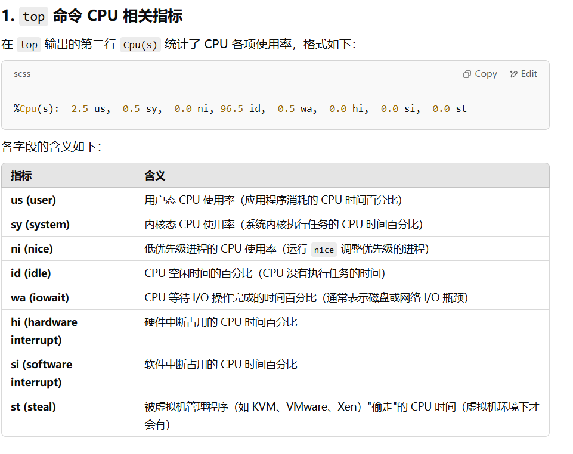

## 1.网络通信netstat, ss, ping, ifconfig
netstat 是用于显示网络连接、路由表、接口统计信息、伪装连接（masquerade connections）等的命令。
netstat is a command used to display **network connections**, **routing tables**, interface statistics, masquerade connections, and more.
netstat -tulnp ：显示所有监听中的 TCP/UDP 端口及其对应的进程
netstat -anp ：显示所有连接（包括 ESTABLISHED 和 LISTEN 状态）以及对应的进程
netstat -rn ：显示路由表
netstat -i ：显示网络接口的统计信息
ss（Socket Statistics）比 netstat 更快、更强大，用于查看网络连接信息。
ping [选项] 目标主机：测试与目标主机的网络连接。
ifconfig 或 ip：用于查看系统的网络接口信息，包括网络接口的 IP 地址、MAC 地址、状态等。
## 2.telnet?
telnet 主要用于远程登录服务器或测试目标端口的连通性。在 SSH 普及后，telnet 主要用于端口测试。

## 3.lsof?
lsof (List Open Files) 用于查看当前系统中被进程打开的文件（包括网络连接、设备文件等）
查看哪个进程占用了某个端口
追踪进程打开的文件
发现被锁定的文件
isof -i :80 : Check which process is using port 80.
isof /path/to/file: Check which process is using a specific file.
isof -p: List all files opened by a specific process.
isof -u: Show files opened by a specific user.
> isof -i :80与netstat -tulnp区别
前者用于查看已经建立的连接, 不仅仅是LISTEN,后者是仅仅监听LISTEN port

## 4.其他sudo, grep, kill, shutdown, reboot
sudo + 其他命令：以系统管理者的身份执行指令，也就是说，经由 sudo 所执行的指令就好像是 root 亲自执行。
grep 要搜索的字符串 要搜索的文件 --color：搜索命令，--color 代表高亮显示。
kill -9 进程的pid：杀死进程（-9 表示强制终止force termination）先用 ps 查找进程，然后用 kill 杀掉。
ps [选项]：用于查看系统中的进程信息，包括进程的 ID、状态、资源使用情况等。ps -ef/ps -aux：这两个命令都是查看当前系统正在运行进程，两者的区别是展示格式不同。如果想要查看特定的进程可以使用这样的格式：ps aux|grep redis （查看包括 redis 字符串的进程），也可使用 pgrep redis -a。

shutdown：shutdown -h now：指定现在立即关机；shutdown +5 "System will shutdown after 5 minutes"：指定 5 分钟后关机，同时送出警告信息给登入用户。
reboot：reboot：重开机。reboot -w：做个重开机的模拟（只有纪录并不会真的重开机）。

## 5.文件权限?
在 Linux 中权限一般分为读(readable)、写(writable)和执行(executable)，分为三组。分别对应文件的属主(owner)，属组(group)和其他用户(other)
chmod: Command to modify file/directory permissions
chmod 777 是用于修改文件或目录权限的命令，其中 777 表示所有用户（所有者、所属组、其他用户）都具有 读取 (r)、写入 (w)、执行 (x) 权限。
755:所有者可以 读 (r)、写 (w)、执行 (x)，其他人只能 读 (r) 和执行 (x)，但不能修改。
## 6.系统状态systemctl, top, uptime, vmstat, free, du, df
systemctl [命令] [服务名称]：用于管理系统的服务和单元，可以查看系统服务的状态、启动、停止、重启等。
top [选项]：用于实时查看系统的 CPU 使用率、内存使用率、进程信息等。

idle% 代表 CPU 处于空闲状态的时间占比，即没有执行任何任务的时间。
uptime [选项]：用于查看系统总共运行了多长时间、系统的平均负载等信息。
Used to check how long the system has been running and view system load averages.
vmstat [间隔时间] [重复次数]：vmstat （Virtual Memory Statistics）报告关于进程、内存、I/O 等系统整体运行状态，
free [选项]：用于查看系统的内存使用情况，包括已用内存、可用内存、缓冲区和缓存等。
du [选项] [文件]：用于查看指定目录或文件的磁盘空间使用情况(Used to check the disk space usage of a specified directory or file.)
df [选项] [文件系统]：用于查看系统的磁盘空间使用情况，包括磁盘空间的总量、已使用量和可用量等，可以指定文件系统上。例如：df -a，查看全部文件系统; df -h查看机器上所有磁盘的使用量.
sar [选项] [时间间隔] [重复次数]：用于收集、报告和分析系统的性能统计信息，
## 7.目录操作
ls：显示目录中的文件和子目录的列表。
ll: 命令可以看到该目录下的所有目录和文件的详细信息
mkdir: 创建新目录（增）
find: 在指定目录及其子目录中搜索文件或目录（查）通配符:wildcard character
pwd（Print Working Directory）: 是 Linux 中用于显示当前所在目录的命令
rmdir：删除空目录（删）
rm [选项]: 文件或目录名：删除文件/目录（删）。例如：rm -r my_directory，删除名为 my_directory 的目录，-r(recursive,递归) 表示会递归删除指定目录及其所有子目录和文件。
cp 复制文件或目录（移）
mv [选项] 源文件/目录 目标文件/目录：移动文件或目录（移）
## 8.文件操作
touch 创建新文件或更新已存在文件（增）
ln [选项] <源文件> <硬链接/软链接文件>：创建硬链接/软链接。
cat/more/less/tail 文件名：文件的查看（查） 
vim 文件名：修改文件的内容（改）
tar: -zcvf Package and compress files. -zxvf Extract or decompress.
## 9.文件传输
scp 基于 SSH 进行安全的远程文件传输。适合小文件传输，但不支持断点续传
rsync 采用 增量同步 支持断点续传(Resumable transfer) 支持本地和远程同步 适合 大文件传输
rz 适合小文件传输，但不支持断点续传(Resumable transfer)
ftp 传统的 文件传输协议，基于 TCP/IP。大规模文件存储

## 10.硬链接与软链接
硬链接: 在 Linux/类 Unix 文件系统中，每个文件和目录都有一个唯一的索引节点（inode）号，用来标识该文件或目录。硬链接通过 inode 节点号建立连接，硬链接和源文件的 inode 节点号相同.ln 命令用于创建硬链接。
软链接(symbolic Link): 软链接和源文件的 inode 节点号不同，而是指向一个文件路径,软连接类似于 Windows 系统中的快捷方式(shortcut)。ln -s 命令用于创建软链接.
## 11.inode 介绍
在 Linux 和类 Unix 文件系统（如 ext4、xfs）中，inode（索引节点） 是用于存储文件元数据（Metadata）的一种数据结构，每个文件或目录都有一个唯一的 inode 号。不存储文件名和内容.
metadata: 文件类型, 文件大小, 硬链接数量, 创建修改访问时间等
inode数量有限制
## 12.什么是Linux?
Linux is an open-source, Unix-like operating system kernel.
如网络接口卡、磁盘驱动器、打印机、输入输出设备、普通文件或目录等，都被视为文件。这是 Linux 系统中一个重要的概念，即"一切都是文件"。即将所有资源都抽象为文件的方式来进行管理和访问. 非常灵活和扩展.
Unix 是一种 多用户、多任务的操作系统.
区别是 unix不是开源的, linux流行,unix不流行.
## 13.环境变量
建议用户级别环境变量在 ~/.bash_profile中配置，系统级别环境变量在 /etc/profile.d 中配置。
export 输出当前环境变量(export -p), 也能修改当前环境变量
vim 可以修改环境变量(bash_profile) source生效环境变量

### 14.nohup 
不受挂起信号（SIGHUP）影响的情况下继续运行，即使用户注销或关闭终端。
background process
Daemon Process 守护进程比如 Cron 定时任务, httpd web服务器

### 15. 怎样查看所有的挂载?
mount
df -h

### 16. 查看僵尸进程并杀死?
僵尸进程（Zombie Process）是 子进程已退出，但父进程未回收 导致的进程状态。
ps aux | grep 'Z' | kill -9 <PPID>

### 17.给一个进程，怎么查看进程的执行位置?
ls -l /proc/<PID>/exe

### 18.如果serverA联不通serverB你要怎么排查问题?trouble shooting?
我们可以使用OSI七层模型排查
网卡:Network Interface Card (NIC)
首先从Data Link Layer排查: 使用arp -a | grep serverB,检查 serverA 是否能获取 serverB 的 **MAC** 地址
其次Network Layer:  测试 serverA 到 serverB 的路由->traceroute serverB
然后Transport Layer: telnet 测试端口(22端口 80端口)
然后session Layer: 检查防火墙:在serverB上面测iptables
然后Application Layer: 检查serverB端口监听:netstat -tulnp | grep 22 -> 检查B是否启用了SeLinux(getenforce, setenforce 0),ping
如果是在云上 security group,域名连接 serverB，可能是 DNS 解析问题
### 19.top命令中 system load 和 system utilization?
System Load（系统负载）: 主要关注的是 CPU 任务的等待情况(waiting status of CPU tasks.)
System Utilization（系统利用率）主要关注的是 CPU、内存、磁盘等资源的占用情况。(the usage of CPU, memory, disk, and other system resources.)