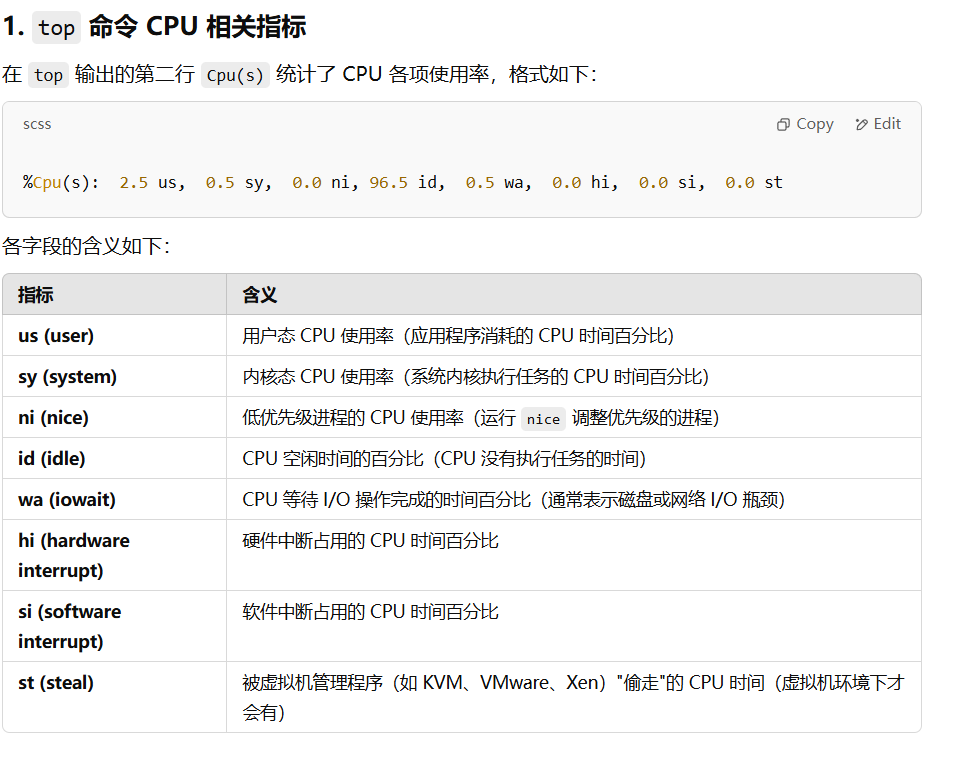

DB: sharding, replication, how to deal with Huge tables. Query time analyze. 
Redis, data types, sharding replica.
Python db pool libs
Networks: troubleshooting, Linux commands: netstat, telnet, lsof .....
OSI models.
docker containerize
kubernetes
## 开场白
### Why this role?
1. 接触到分布式项目
2. 学技术教人脉
### Why this company?
为世界上一些最棘手的问题构建前所未有的解决方案
加入一支由多元化创新者组成的团队
伟大的平台, 我的很多朋友加入了Ericsson
not only learning but also building relationship

## 简历

### 1.索引策略以及sql查询优化
1. **慢SQL定位与分析**
>启用SET profiling = 1;
>运行SQL
>查询总的运行时间SHOW PROFILES;
>查看SQL执行各个阶段的耗时 SHOW PROFILE FOR QUERY 1;
Opening tables-> too much join operation
System lock	-> 
Optimizing -> wrong index
Statistics -> table data too large
Sending data-> table data too large
使用 EXPLAIN / EXPLAIN ANALYZE (select_type, type, key, extra) -> judge whether the index is being used correctly.
type = ALL → 说明是 全表扫描，应考虑增加索引
rows = 1000000 → 说明扫描的行数过多，可能需要 优化 WHERE 条件
key(实际使用的索引) = NULL → 说明没有使用索引，需要 增加索引

2. **索引创建原则**

不为null字段加索引
给频繁查询的字段加索引
给作为查询条件的字段加索引, where之后的条件
给频繁排序的字段加索引
索引一张表不应该超过5个

覆盖索引(Covering Index)
索引中已经包含了所有需要获取的字段的查询方式称为覆盖索引。避免 InnoDB 表进行索引的二次查询(避免使用回表)

3. **SQL优化:**
避免使用select all the columns in the table
使用连接查询代替子查询(避免 `IN`，使用 `EXISTS` 或 `JOIN`)Use JOIN queries instead of subqueries.

4. **数据库参数调优:**

调整 `innodb_buffer_pool_size` index and data page, the half of the physical memory

5. **增加缓存机制**
使用Redis加一个缓存层

### 2.重新设计restfui api

防止返回过多的**data**
(避免**嵌套查询**)避免 **N+1 查询**，减少不必要的 API 调用
**逻辑修改**: 批量上传图片改为用户点击一次上传一次

### 3.redis message queue?

- **订单生成**：订单对象存入 Redis(hset)，并初始状态设为“待支付”。
- **支付回调**：
    - 支付 API 异步返回结果后，读取订单对象(hgetall),更新订单状态为“支付成功”或“支付失败”。
    - 如果支付成功，使用 XADD 将支付成功的消息写入 Stream。
- **开卡服务**：
    - 通过消费者组监听 Stream 消息，收到支付成功消息后调用开卡 API。使用xrange()读取消息,xread() 或 xreadgroup()消费数据.
    - 开卡成功后更新订单状态，并使用 XACK 确认消息处理完毕。

## Python
### 3.python数据库连接池
(database connection pool)
sqlalchemy
QueuePool（默认池）
在 SQLAlchemy 中，数据库连接池的配置主要通过 create_engine() 的参数进行控制

## DataBase
### 1.How to deal with huge tables?
1.  水平分表: Horizontal Partitioning-> Split a large table into smaller tables based on a key
2.  垂直分表: Vertical Partitioning-> Split a wide table into multiple smaller tables by moving less frequently used columns into separate tables.
3.  索引优化: index optimization-> Use covering indexes,Avoid too many indexes
4.  读写分离: read & write split
5.  分析查询: EXPLAIN -> Use EXPLAIN ANALYZE to find slow queries.
### 2.Sharding?
和redis一样
### 3.Replica?
不论是使用哪一种读写分离具体的实现方案，想要实现读写分离一般包含如下几步：

1. 部署多台数据库，选择其中的一台作为主数据库，其他的一台或者多台作为从数据库。
2. 保证主数据库和从数据库之间的数据是实时同步的，这个过程也就是我们常说的**主从复制**。
3. 系统将写请求交给主数据库处理，读请求交给从数据库处理。

MySQL binlog(binary log 即二进制日志文件) 主要记录了 MySQL 数据库中数据的所有变化(数据库执行的所有 DDL 和 DML 语句)。因此，我们根据主库的 MySQL binlog 日志就能够将主库的数据同步到从库中。
更具体和详细的过程是这个样子的（图片来自于：[《MySQL Master-Slave Replication on the Same Machine》](https://www.toptal.com/mysql/mysql-master-slave-replication-tutorial)）：
**MySQL 主从复制是依赖于 binlog 。另外，常见的一些同步 MySQL 数据到其他数据源的工具（比如 canal）的底层一般也是依赖 binlog 。**
## Redis
### 1.Data types?
5 种基础数据类型：String（字符串）、List（列表）、Set（集合）、Hash（散列）、Zset（有序集合）。3 种特殊数据类型：HyperLogLog（基数统计）、Bitmap （位图）、Geospatial (地理位置)。
### 2.Sharding?
Redis Sharding（分片） 指的是 将 Key-Value 数据分散存储在多个 Redis 服务器上，而不是放在一个单一的 Redis 实例中。这样，每个实例只存储部分数据，解决单机存储和负载瓶颈。
Answer:

> Redis Cluster provides a way to run a Redis installation where data is automatically **sharded** across multiple Redis nodes. It's important because it allows for data **partitioning**, which helps in scaling out the database across multiple machines, enhancing performance and availability.
Redis Sharding methods?
> Client-side sharding: 哈希分片（Hash-based Sharding）（Key % N）或 范围分片Range-based Sharding 或 一致性哈希
> Redis Cluster（官方分片）->hash slots,扩容时，Redis Cluster 自动将部分哈希槽迁移到新节点。

### 3.Replica?
Redis 采用**主从复制（Master-Replica）**模型：
主节点（Master） 处理写请求，并同步数据给所有从节点（Replica）。
从节点（Replica） 只接受读请求，并定期从主节点同步数据。
Redis 复制分为 初始全量同步(Full Resync) 和 增量数据同步(Partial Resync)Incremental Update 两个阶段
## Network
### 1.如果serverA联不通serverB你要怎么排查问题?trouble shooting?
我们可以使用OSI七层模型排查
网卡:Network Interface Card (NIC) **ping**
首先从Data Link Layer排查: 使用arp -a | grep serverB,检查 serverA 是否能获取 serverB 的 **MAC** 地址
其次Network Layer:  测试 serverA 到 serverB 的路由->**traceroute** serverB
然后Transport Layer: **telnet** 测试端口(22端口 80端口)
然后session Layer: 检查防火墙:在serverB上面测**iptables**
然后Application Layer: 检查serverB端口监听:**netstat** -tulnp | grep 22 -> 检查B是否启用了**SeLinux**(getenforce, setenforce 0)
如果是在云上 security group,域名连接 serverB，可能是 DNS 解析问题
### 2.Linux commands?
#### 1.网络通信netstat, ss, ping, ifconfig
netstat 是用于显示网络连接、路由表、接口统计信息、伪装连接（masquerade connections）等的命令。
netstat is a command used to display **network connections**, **routing tables**, interface statistics, masquerade connections, and more.
netstat -tulnp ：显示所有监听中的 TCP/UDP 端口及其对应的进程
netstat -anp ：显示所有连接（包括 ESTABLISHED 和 LISTEN 状态）以及对应的进程
netstat -rn ：显示路由表
netstat -i ：显示网络接口的统计信息
ss（Socket Statistics）比 netstat 更快、更强大，用于查看网络连接信息。
ping [选项] 目标主机：测试与目标主机的网络连接。
ifconfig 或 ip：用于查看系统的网络接口信息，包括网络接口的 IP 地址、MAC 地址、状态等。
#### 2.telnet?
telnet 主要用于远程登录服务器或测试目标端口的连通性。在 SSH 普及后，telnet 主要用于端口测试。

#### 3.lsof?
lsof (List Open Files) 用于查看当前系统中被进程打开的文件（包括网络连接、设备文件等）
查看哪个进程占用了某个端口
追踪进程打开的文件
发现被锁定的文件
isof -i :80 : Check which process is using port 80.
isof /path/to/file: Check which process is using a specific file.
isof -p: List all files opened by a specific process.
isof -u: Show files opened by a specific user.
> isof -i :80与netstat -tulnp区别
前者用于查看已经建立的连接, 不仅仅是LISTEN,后者是仅仅监听LISTEN port
#### 6.系统状态systemctl, top, uptime, vmstat, free, du, df
systemctl [命令] [服务名称]：用于管理系统的服务和单元，可以查看系统服务的状态、启动、停止、重启等。
top [选项]：用于实时查看系统的 CPU 使用率、内存使用率、进程信息等。

idle% 代表 CPU 处于空闲状态的时间占比，即没有执行任何任务的时间。
uptime [选项]：用于查看系统总共运行了多长时间、系统的平均负载等信息。
Used to check how long the system has been running and view system load averages.
vmstat [间隔时间] [重复次数]：vmstat （Virtual Memory Statistics）报告关于进程、内存、I/O 等系统整体运行状态，
free [选项]：用于查看系统的内存使用情况，包括已用内存、可用内存、缓冲区和缓存等。
du [选项] [文件]：用于查看指定目录或文件的磁盘空间使用情况(Used to check the disk space usage of a specified directory or file.)
df [选项] [文件系统]：用于查看系统的磁盘空间使用情况，包括磁盘空间的总量、已使用量和可用量等，可以指定文件系统上。例如：df -a，显示所有文件系统的磁盘使用情况; df -h查看机器上所有磁盘的使用量.
sar [选项] [时间间隔] [重复次数]：用于收集、报告和分析系统的性能统计信息，
### 3.OSI models?

2xx（成功响应）
200 OK：请求成功，返回数据（常见于 GET、POST 请求）。
201 Created：请求成功，已创建资源（常见于 POST 请求）。
204 No Content：请求成功，但无返回内容（常见于 DELETE 请求）。
3xx（重定向响应）
301 Moved Permanently：资源已永久移动，新地址需使用 Location 头部字段提供。
302 Found：资源临时移动，客户端仍应使用原地址请求（但服务器可能提供新地址）。
304 Not Modified：资源未修改，客户端可使用缓存版本（用于 If-Modified-Since 或 ETag 机制）。
4xx（客户端错误）
400 Bad Request：请求格式错误，服务器无法解析。
401 Unauthorized：未授权，需提供身份验证信息（如 Token 失效）。
403 Forbidden：禁止访问，权限不足。
404 Not Found：请求的资源不存在。
405 Method Not Allowed：请求方法不被允许（如对 GET 资源使用 POST）。
5xx（服务器错误）
500 Internal Server Error：服务器内部错误，无法完成请求。
502 Bad Gateway：网关或代理服务器收到无效响应。
503 Service Unavailable：服务器暂时无法处理请求（通常因过载或维护）。
504 Gateway Timeout：网关或代理服务器未及时收到上游服务器响应。
## Docker

## Kubernetes

## 结尾
### 反问
如何避免主从延迟?
(强制将读请求路由到主库处理,延迟读取)
数据库分库分表后，如何进行 SQL 查询？
(应用层聚合, 使用分布式数据库框架ShardingSphere)
What kind of **impact** could I make or contribute to if I join the team? 
What's the **next step** in the interview process?