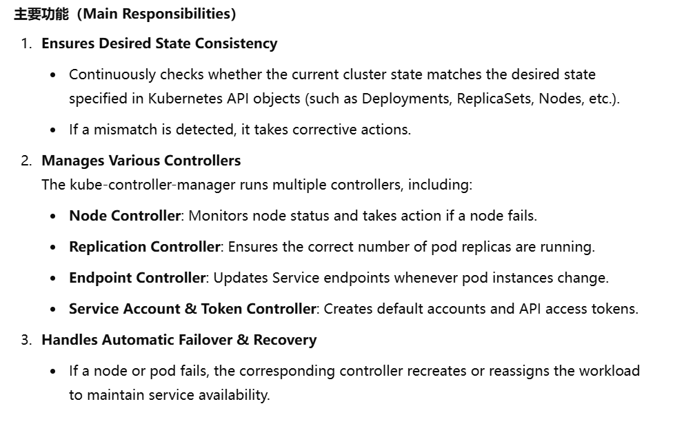

# Kubernetes Interview Questions and Answers

Kubernetes is a powerful tool that helps automate the deployment, scaling, and management of applications using containers. It’s a favorite for handling complex apps because it makes everything more efficient and scalable. Named after the Greek word for "captain," Kubernetes has become essential in cloud-based applications, used by top companies like ****Google****, ****Red Hat****, and ****IBM****.

In this interview preparation guide, we have covered the top 40 Kubernetes interview questions and answers, covering key topics like ****Kubernetes architecture****, ****pods****, ****StatefulSets****, ****monitoring****, and ****deployment strategies****. Whether you're a fresher or an experienced pro, these questions will boost your DevOps interview prep!

Jump to the section you like to read!

Table of Content

* [Basic Kubernetes Interview Questions](#basic-kubernetes-interview-questions)
* [Intermediate Kubernetes Interview Questions](#intermediate-kubernetes-interview-questions)
* [Advanced Kubernetes Interview Questions](#advanced-kubernetes-interview-questions)
* [Kubernetes Interview Questions For Experienced](#kubernetes-interview-questions-for-experienced)

## Basic Kubernetes Interview Questions

### What is Kubernetes?

****Kubernetes is an open-source platform designed to automate deploying, scaling, and operating application containers.**** Originally developed by **Google**, it has become the standard for managing containerized workloads and services. Kubernetes provides a robust framework for **orchestrating containers across a cluster of machines**, abstracting away the complexities of managing individual containers and allowing developers to focus on **building and deploying** applications.

With Kubernetes, users can define application components, their interdependencies, and scaling policies using declarative configuration files, which Kubernetes then uses to ensure the desired state of the application is maintained.

### 1. Explain Kubernetes Architecture.

Kubernetes is an open-source container deployment and administration platform. It offers [****container orchestration****](https://www.geeksforgeeks.org/kubernetes-introduction-to-container-orchestration), container runtime, container-centric infrastructure orchestration, balance of load, self-healing mechanisms, and service discovery. A Kubernetes cluster has several control planes and one or more worker nodes.

.jpg)

### 2. Explain the concept of Container Orchestration.

[****Container orchestration****](https://www.geeksforgeeks.org/kubernetes-introduction-to-container-orchestration)**** ****is a tool that developers may use anywhere there are containers to automate the life cycle management of the containers. It provides a automatic deployment, scaling, and management of containerized applications so that the developers do not have any worry about that the underlying infrastructure.

### 3. What is a Pod in Kubernetes?✅

A Pod is the **smallest** and most basic deployable unit in Kubernetes. It represents a single instance of a running process in the cluster. A pod can contain one or multiple containers that share the same network namespace, storage volumes, and configuration.
代表了集群中单一运行进程实例
> kubectl get pods -n \<namespace-name>

### 4. How does Kubernetes handle container scaling?

To automatically scale the workload to match demand, a [****Horizontal Pod Autoscaling****](https://www.geeksforgeeks.org/how-to-use-kubernetes-horizontal-pod-autoscaler) in Kubernetes updates a workload resource (such a deployment or stateful set). Horizontal scaling indicates that more pods are added in response to an increase in load.

> apiVersion: autoscaling/v2beta2
>
> kind: HorizontalPodAutoscaler
>
> metadata:
>
> name: my-hpa
>
> spec:
>
> scaleTargetRef:
>
> apiVersion: apps/v1
>
> kind: Deployment # or StatefulSet, or ReplicaSet, depending on your workload
>
> name: my-deployment
>
> minReplicas: 3
>
> maxReplicas: 5
>
> metrics:
>
> \- type: Resource
>
> resource:
>
> name: cpu
>
> target:
>
> type: Utilization
>
> averageUtilization: 65

### 5. What is Kubelet?✅

Kubelet is an essential component of Kubernetes that runs on each worker node. It is responsible for managing the lifecycle of pods and containers running on that node. Kubelet communicates with the Kubernetes API Server, receives instructions, and ensures that the node is running the assigned workloads correctly.
1. 管理pod node生命周期
2. 与api server 交流
3. 自愈:pod挂了重启
### 6. Explain the difference between a StatefulSet and a Deployment.✅

A StatefulSet and a Deployment are both Kubernetes workload resources used to manage and scale applications
**Deployment**: Ideal for stateless applications, such as web servers, API backends, and microservices.

**StatefulSet**: Designed for stateful applications, such as databases (MySQL, PostgreSQL), distributed systems (Kafka, Elasticsearch).

| StatefulSet                                                                                                      | Deployment                                                                                                          |
| ---------------------------------------------------------------------------------------------------------------- | ------------------------------------------------------------------------------------------------------------------- |
| A collection of identical stateful pods are handled by the resource is called StatefulSet.                       | This resource controls identical pods deployment.                                                                   |
| Statefulset helpful in managing stateful applications that need persistent storage with a dependable network ID. | It enables you to control your application's state and ensure that the right number of replicas are always running. |

### 7. What is a Service in Kubernetes?

The idea of the Service is to group a set of Pod endpoints into a single resource. We can configure various ways to access the grouping. By default, we can get a stable cluster [****IP address****](https://www.geeksforgeeks.org/what-is-an-ip-address) that the clients inside the cluster can use to contact Pods in Service.

> apiVersion: v1
>
> kind: Service
>
> metadata:
>
> name: my-service
>
> spec:
>
> selector:
>
> Tomcat: deploymentapp
>
> ports:
>
> \- protocol: TCP
>
> port: 80
>
> targetPort: 8080

### 8. How does Kubernetes manage configuration?✅
使用ConfigMaps和Sercrets
Kubernetes employs ****ConfigMaps**** and **Secrets** to manage configuration. ConfigMaps store non-sensitive setup data, while Secrets handles sensitive information like passwords. These resources have different configurations from the application code, making updates easier. ConfigMaps have key-value pairs for different settings that can be accessed as **environment variables** or **mounted files**. Sensitive data is securely stored in [****Secrets****](https://www.geeksforgeeks.org/kubernetes-secrets), which are applied to the cluster using kubectl. Both ConfigMaps and Secrets are defined in [****YAML files****](https://www.geeksforgeeks.org/difference-between-yaml-yml-and-properties-file-in-java-springboot) and applied to the cluster using kubectl. Kubernetes tracks changes in these resources, triggering updates in Pods without needing changes to the application code.

### 9. Describe the role of a Master node in Kubernetes.✅
1. 集群管理
2. 提供api 配置管理资源
[Kubernetes master node](https://www.geeksforgeeks.org/introduction-to-kubernetes-k8s)components can be run within Kubernetes itself, as a set of containers within the dedicated pod. The master node is responsible for **cluster management** and for providing the **API** that is used to configure and manage resources within the Kubernetes cluster.

### 10. What is the role of the kube-proxy in Kubernetes and how does it facilitate communication between Pods?✅
Ingress -> Kube-proxy
kube-proxy is a network component in Kubernetes that runs on each node. It is responsible for maintaining network rules and ensuring that services can communicate with each other inside the cluster.
communication between different pods within the cluster by maintaining network routing rules.
1. 维护网络规则
2. 使得pod内部可以通信

## Intermediate Kubernetes Interview Questions

Here are some ****Intermediate-Level Kubernetes Interview Questions and Answers**** to help you prepare for your interviews:

### 11. Explain the concept of Ingress in Kubernetes.✅
Ingress is a [****Kubernetes API****](https://www.geeksforgeeks.org/kubernetes-api) object that is used to expose [****HTTP and HTTPS ****](https://www.geeksforgeeks.org/difference-between-http-and-https-2)routes from outside the cluster to services inside the cluster. It provides a single entry point into a cluster, it allows more straightforward management applications and troubleshooting routing issues.\
 

### 12. What is a ConfigMap?✅
存储不敏感数据,分离代码以及配置文件
A [****ConfigMap****](https://www.geeksforgeeks.org/kubernetes-configmap)**** ****is an API object in Kubernetes that is primarily used to store non-confidential data. ConfigMaps are a way for Kubernetes to inject configuration data into application pods, making it easier to manage and update configuration settings and assist in separating configuration from application code.

### 13. Describe the role of etcd in Kubernetes.✅

etcd is a **distributed key-value store** that serves as the backbone of Kubernetes' **cluster state management**. It stores all cluster configuration data, such as **node states**, deployments, **services**, and** networking information**. Kubernetes uses etcd as its single source of truth to persist and retrieve all **state-related** data.

### 14. How do rolling updates work in a Deployment?

The rolling update deployment strategy, additionally referred to as a rolling deployment, makes sure of zero downtime by methodically replacing out of date Pods with updated ones, facilitating a smooth transition during Deployment updates. A rolling deployment is a strategic approach that gradually substitutes older versions of an application with newer ones through an overall replacement of the underlying infrastructure.

### 15. What is a Namespace in Kubernetes?

[****Namespaces****](https://www.geeksforgeeks.org/kubernetes-namespaces)**** ****permit Kubernetes clusters to be organized into virtual sub-clusters, which is useful in situations where a cluster is utilized by several teams or projects. Namespaces allow a cluster to be structured in any number of ways, with each namespace providing logical segregation from the others while maintaining the ability to speak across namespaces.

### 16. Explain the use of Labels and Selectors in Kubernetes.

[****Labels and Selectors****](https://www.geeksforgeeks.org/kubernetes-labels-selectors) are essential sections in Kubernetes configuration files for deployments and services due to how they link Kubernetes services to pods. Labels are key-value pairs that identify pods distinctly; the deployment assigns these labels and uses them as a starting point for the pod prior to its creation, and the Selector matches these labels. Labels and selectors combine to create connections between deployments, pods, and services in Kubernetes.

### 17. Describe the role of a Proxy in Kubernetes.

One essential Kubernetes agent that exists on every cluster node is called [****Kube-Proxy****](https://www.geeksforgeeks.org/kubernetes-architecture). Its primary function is to keep track of modifications made to the Service of objects and the endpoints that correspond to them. It then changes these modifications into actual network rules that are implemented into the node.

### 18. What is a Persistent Volume (PV) in Kubernetes?

A [****Persistent Volume (PV)****](https://www.geeksforgeeks.org/kubernetes-volumes)**** ****in Kubernetes is an object that allows pods to access storage from a defined device. This device is usually described via a Kubernetes StorageClass. When a PVC is created individually, it is generated and designated to the specified storage device. This method wins out over pretreated storage classes because it gives a better understanding of the workflow.

> apiVersion: v1
>
> kind: PersistentVolume
>
> metadata:
>
> name: mypv
>
> spec:
>
> capacity:
>
> storage: 2Gi
>
> accessModes:
>
> \- ReadWriteOnce
>
> persistentVolumeReclaimPolicy: Retain
>
> hostPath:
>
> path: "/mnt/data"

### 19. Explain the differences between a DaemonSet and a ReplicaSet.

| ****ReplicaSet****                                                                                                                           | ****DaemonSet****                                                                                                  |
| -------------------------------------------------------------------------------------------------------------------------------------------- | ------------------------------------------------------------------------------------------------------------------ |
| On any node, ReplicaSet will make sure that the number of operating pods in the Kubernetes cluster match the number of pods that is planned. | ****Every node will have just the minimum of one pod of the application that we deployed because of DaemonSet.**** |
| Replicaset most suitable for applications like web applications which are stateless.                                                         | ****Stateful applications are best fits for it.****                                                                |

### 20. How can you achieve communication between Pods in different Nodes?

Pods in a cluster of k8s can speak to one another by default use the internal IP addresses. The underlying container runtime or network plugin gives a virtual network overlay to this communication.

### 21. What advantages does Kubernetes have?

Kubernetes has the following advantages:

* Container Orchestration
* Automated Load Balancing
* Auto Scaling
* Rolling Update & Rollbacks
* Service Discovery and Load Balancing
* Storage Orchestration
* Self-Healing
* Secrets and Configuration Management
* Multi-Cloud and Hybrid Cloud Support
* Role-Based Access Control (RBAC)
* Pods and Multi-Container Support
* Monitoring and Logging

****Also Read: ****[Fundamental Kubernetes Components](https://www.geeksforgeeks.org/fundamental-kubernetes-components-and-their-role-in-container-orchestration)

## Advanced Kubernetes Interview Questions

Kubernetes Interview Questions and Answers

### 22. What is the role of the kube-scheduler in Kubernetes?✅ 

This [****Kubernetes scheduler****](https://www.geeksforgeeks.org/videos/how-a-kubernetes-scheduler-works), a control plane mechanism, is in charge of assigning Pods to Nodes; it evaluates constraints and readily accessible assets to identify acceptable candidate Nodes for each Pod in the scheduling queue. [****Kube-scheduler****](https://www.geeksforgeeks.org/kubernetes-architecture), the default scheduler for Kubernetes, works within the control plane and is intended to provide users with the option to develop and implement their custom scheduling components.

### 23. Describe how a Horizontal Pod Autoscaler (HPA) works.

With a dedicated instance for each workflow, each configured [****Horizontal Pod Autoscaler**** ](https://www.geeksforgeeks.org/how-to-use-kubernetes-horizontal-pod-autoscaler)works as part of a control loop, automatically changing the workloads' shape to maintain the desired state by periodically contrasting its metrics to the user-configured target thresholds.

> apiVersion: autoscaling/v2
>
> kind: HorizontalPodAutoscaler
>
> metadata:
>
> name: webserver-mem-hpa
>
> spec:
>
> maxReplicas: 5
>
> minReplicas: 1
>
> scaleTargetRef:
>
> apiVersion: apps/v1
>
> kind: Deployment
>
> name: webserver
>
> metrics:
>
> \- type: Resource
>
> resource:
>
> name: memory
>
> target:
>
> type: Utilization
>
> averageValue: 2Mi

### 24. Explain the concept of Custom Resources in Kubernetes.

Following a custom resource is installed, users can create and access its objects using [****kubectl****](https://www.geeksforgeeks.org/kubernetes-kubectl-delete), just like they do for built-in resources like Pods. A custom resource is an extension of the Kubernetes API that is not always available in a default**** ****[****Kubernetes installation****](https://www.geeksforgeeks.org/kubernetes-installation-methods). However, many core Kubernetes functions are now built using custom resources, making Kubernetes more modular. Custom resources can come and go in a running the cluster through dynamic registration, and cluster admins can update custom resources independently of the cluster.

### 25. How does Kubernetes handle security and access control?

Using robust access restrictions and encryption techniques, like Kubernetes Secrets or external key management systems, can help safeguard sensitive data kept within your cluster. To prevent unwanted access, data must be encrypted as it is in transit and at rest.

### 26. What is a Network Policy in Kubernetes?

[****Kubernetes Network Policies****](https://www.geeksforgeeks.org/kubernetes-policies) are an application-centric build that let you specify how pod is allowed to communicate with various network "entities" (we use the term "entity" here to avoid over change the more common terms such as "endpoints" and "services", which have specific K8s connotations) over the network. Network Policies apply to the connection with pod on one or both sides, and are not relevant to any other connections.

### 27. Describe the role of a kube-proxy in the cluster.

Kube-Proxy is an important Kubernetes agent that stays on every cluster node. Its main function is to keep track of adjustments made to Service objects and the endpoints that correspond to them. Based on the changes made, it switches them into concrete network rules on the node.

### 28. What is a Helm chart, and how is it used?

Helm utilizes a packaging format called charts, which are collection of files which describe the cohesive set of Kubernetes resources. Whether you are deploying a simple component, like a memcached pod, or a complex web app stack which involves HTTP servers, databases, caches, and more, all the files you need are contained in a single chart. Helm chart packages provide all the resources you need to deploy an application to a Kubernetes cluster, which involves YAML configuration files for secrets, services, deployments, and config maps that provide the app's desired state.

### 29. Explain the concept of Taints and Tolerations in Kubernetes.

[****Tolerances****](https://www.geeksforgeeks.org/kubernetes-taint-and-toleration), when applied to pods, enable the scheduler to schedule them in the presence of matching taints. However, tolerating a pod does not ensure scheduling, as the scheduler considers other factors when making its decision. Node affinity is a property of Pods that either expresses a preference or sets a hard requirement to attract them to a specific set of nodes. [****Taints****](https://www.geeksforgeeks.org/kubernetes-taint-and-toleration), on the other hand, work as the opposite, allowing a node to repel a specific group of pods.

> apiVersion: v1
>
> kind: Pod
>
> metadata:
>
> name: nginx
>
> labels:
>
> env: test
>
> spec:
>
> containers:
>
> \- name: nginx
>
> image: nginx
>
> imagePullPolicy: IfNotPresent
>
> tolerations:
>
> \- key: "example-key"
>
> operator: "Exists"
>
> effect: "NoSchedule"

### 30. How does Kubernetes manage storage orchestration?

The [****Container Storage Interface****](https://www.geeksforgeeks.org/kubernetes-volumes)**** ****(CSI) is the standard to establish device-independent relationships across block and file storage systems and containerized workloads. In essence, CSI allows storage interfaces to be declared to be implemented by containers.

### 31. Describe the use of init containers in Kubernetes.

This page provides an overview of init containers, which are specialized containers that carry out in front of app containers in a Pod. You can specify init containers in the Pod specification as well as to the containers array (which describes app containers). Init containers can contain utilities or setup scripts that aren't present in an app image. Resource limitations, volumes, and security settings are just a few of the characteristics and functions that app containers support in it containers.

### 32. In Kubernetes, what are the various services available?

Kubernetes supports a number of services, include the following: 1) Cluster IP, 2) Node Port, 3) Load Balancer, & 4) External Name Creation.

#### 1. Cluster IP Service

A ClusterIP service in Kubernetes provides a stable virtual IP address (Cluster IP) to the service, allowing internal communication between various parts in the Kubernetes cluster, it exposes a set of Pods within the cluster to other objects in the cluster.

#### 2. Node Port Service

A NodePort service in Kubernetes is a type of service that allows a group of Pods accessible to external customers on an allocated port on all cluster nodes.

#### 3. Load Balancer service

An external load balancer is automatically provided by a LoadBalancer service in Kubernetes to distribute incoming traffic between the Pods when a group of Pods are accessible to the outside world.

#### 4. External Name Creation Service

An ExternalName service in Kubernetes works as an alias which allows pods inside the cluster to contact services outside cluster using a user-defined DNS name. External name provides DNS-based service discovery to map a service to an external DNS name.

****Also Read: ****[****Kubernetes - Images****](https://www.geeksforgeeks.org/kubernetes-images)

## ****Kubernetes Interview Questions ****For Experienced

### 33. Explain the concept of a Custom Operator in Kubernetes.

Utilizing the Kubernetes API, operators automate procedures like application deployment, scaling, and governance, offering a smooth and integrated approach to resource management. Operators usually set up as custom controllers and extend the Kubernetes API with new resources and specialized logic for their management.

### 34. Describe the internals of the Kubernetes control plane.

Worker nodes, pods, and other cluster resources are administered by the**** ****[****Kubernetes control plane****](https://www.geeksforgeeks.org/what-is-kubernetes-control-plane). It receives data regarding cluster activity, requests from both internal and external sources, and various other things. Then, it applies this information to move the cluster resources from their current state to the desired state.

### 35. What is the purpose of the Kubernetes API server?✅
集群的入口，负责处理 kubectl 或 API 请求。
As the front end to the cluster's shared state, the API server manages REST operations and serves as the hub through which all other components communicate. Its main responsibility is to **receive and handle** HTTP requests in the form of API calls, which come from consumers or other Kubernetes system components. The [****Kubernetes API server****](https://www.geeksforgeeks.org/kubernetes-api) is crucial to the validation as well as the configuration of data for different API objects, including pods, services, replication controllers, and more.

### 36. How does Kubernetes handle rolling back deployments?

In Kubernetes, you can roll back a deployment using the \`kubectl rollout} command. This command provides an array of options to control rollbacks, like \`kubectl rollout undo\`, which flips back the current deployment to the previous revision. You can also use the \`--to-revision} flag to specify a specific revision.

> kubectl rollout undo deployment \<deployment-name>

> kubectl rollout undo deployment \<deployment-name> --to-revision=\<revision-number>

### 37. Explain the concept of Pod Disruption Budgets.

It is intended for application owners who want to build highly available applications and also serves as a guide for cluster administrators who are building automated cluster actions such as autoscaling and upgrades. Pod disruption budgets, or PDBs for short, are policies that specify the desired state of the cluster and the orchestrators' attempt to maintain it. For PDBs, this consists of defining a maximum quantity of failed pods or the lowest number of pod replicas that must stay in the cluster at any given time.

### 38. What is the role of the kube-controller-manager?✅ 

As a daemon, the Kubernetes controller manager incorporates all of the basic control loops that make up Kubernetes. A control loop in robotics and automation is an ongoing mechanism that manages the state of the system. In Kubernetes, a controller is a control loop that keeps an eye on the cluster's shared state through the api server and makes modifications to bring the current state into line with the desired state. Some of the controllers that come packaged with Kubernetes are the replication controller, endpoints controller, namespace controller, and service accounts controller.

### 39. Describe the role of kube-apiserver in the Kubernetes architecture.

The frontend to the cluster's shared state which all other components interact with is the [****Kubernetes API server****](https://www.geeksforgeeks.org/kubernetes-api). It handles REST operations, validation of data and configuration of various API objects like pods, services, and replication controllers, and provides an encompassing interface for managing the cluster's overall state and allowing communication with all components.

### 40. How does Kubernetes handle node failures and resiliency?

Whenever a node fails or a container becomes hazardous, Kubernetes makes sure that a sufficient amount of replicas is maintained by launching new replicas on numerous servers, which maintains continuous availability.

Here are some key mechanisms and strategies that Kubernetes employs:

* Node Health Monitoring
* Pod Restart Policies
* Replication and Desired State
* Pod Disruption Budgets
* Node Pools and Multi-Cloud Deployments

### 41. Explain how to set up and use Role-Based Access Control (RBAC) in Kubernetes.

Initially choose a few broad user categories and the degree of access that each one needs. These choices will be based on the method of authentication you decide as well as the demands of your organization. After you have made the decisions, you can set up role bindings for every group of user.

### 42. What is the role of the Cloud Controller Manager in a cloud-based Kubernetes cluster?

The cloud-controller-manager, a crucial Kubernetes control plane component, encapsulates cloud-specific control logic. This manager facilitates the integration of your cluster with the API of your cloud provider, effectively segregating components that interact with the cloud platform from those that solely interact with the Kubernetes cluster. As part of its capabilities, the cloud controller manager regulates the Node controller, which is in charge of tasks like removing deleted Kubernetes nodes from the cloud environment and setting up cloud infrastructure technologies.

### 43. Describe a few important Kubectl commands.

The following are important Kubectl commands:

* kubectl api-resources
* kubectl autoscale
* kubectl annotate
* kubectl cluster-info
* kubectl attach
* kubectl apply
* kubectl update
* kubectl edit
* kubectl config set
* kubectl config
* kubectl config current-context.

### 44. What is Helm of Kubernetes?✅

**Helm** is a package manager for Kubernetes that simplifies the deployment and management of applications. It uses Charts, which are similar to APT or YUM packages in Linux distributions, to define, install, and upgrade Kubernetes applications, making deployments more repeatable, maintainable, and shareable.

Helm's main features are as follows:

* Charts
* Templating
* Repositories
* Reusability
* Parameterization
* Dependency Management
* Release Management

### 45. Install Kubernetes?
1. 准备:两台AWS EC2 service, Centos8, k8s 1.28
2. 安装Docker
3. 安装kubelet(开机自启) kubeadm kubectl
4. 使用kubeadm 初始化Master Node, 加入Worker Node(join)
5. 开启Kubernetes DashBoard

### 46.常见的k8s命令?
1. 查询pod状态:kubectl get pods
2. 查询pod日志:kubectl logs <pod-name>
3. 列出命名空间:kubectl get namespaces
4. 列出pod所在的node: kubectl get pods -o wide

## Other Important Topics Related To Kubernetes For Interview

Below is a table for the important topics related to Kubernetes that are important for interviews:

| ****Topic****                                                            | ****Description****                                                                                                                                                                        |
| ------------------------------------------------------------------------ | ------------------------------------------------------------------------------------------------------------------------------------------------------------------------------------------ |
| ****1. Kubernetes****                                                    | An open-source container orchestration tool/system used for automating tasks like management, monitoring, scaling, and deployment of containerized applications.                           |
| ****2. K8s****                                                           | Another term for Kubernetes.                                                                                                                                                               |
| ****3. Orchestration****                                                 | Integration of multiple services to automate processes or synchronize information. In the context of Kubernetes, orchestration ensures seamless communication among individual containers. |
| ****4. Architecture****                                                  | Understanding Kubernetes components: master node, worker nodes, etcd, API server, controller manager, and scheduler.                                                                       |
| ****5. Pods****                                                          | The basic unit in Kubernetes, containing one or more containers.                                                                                                                           |
| ****6. Services****                                                      | Exposing pods to the network. Types: ClusterIP, NodePort, Load Balancer, and ExternalName.                                                                                                 |
| ****7. Replication Controllers****                                       | Ensuring a specified number of replicas of a pod are running.                                                                                                                              |
| ****8. Deployments****                                                   | Managing rolling updates and rollbacks.                                                                                                                                                    |
| ****9. ConfigMaps and Secrets****                                        | Managing configuration data and sensitive information.                                                                                                                                     |
| ****10. Persistent Volumes (PVs) and Persistent Volume Claims (PVCs)**** | Managing storage for stateful applications.                                                                                                                                                |
| ****11. Ingress Controllers****                                          | Routing external traffic to services within the cluster.                                                                                                                                   |
| ****12. Helm****                                                         | Package manager for Kubernetes.                                                                                                                                                            |
| ****13. Security****                                                     | RBAC, Network Policies, and Pod Security Policies.                                                                                                                                         |
| ****14. Monitoring and Logging****                                       | Prometheus, Grafana, and ELK stack.                                                                                                                                                        |
| ****15. Troubleshooting****                                              | Diagnosing issues with pods, services, and nodes.                                                                                                                                          |
